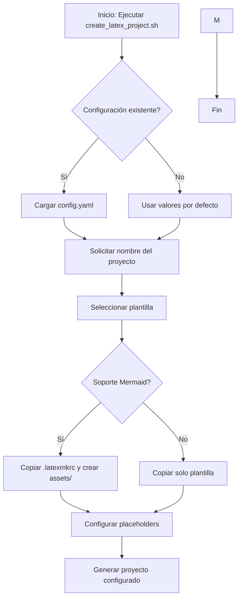
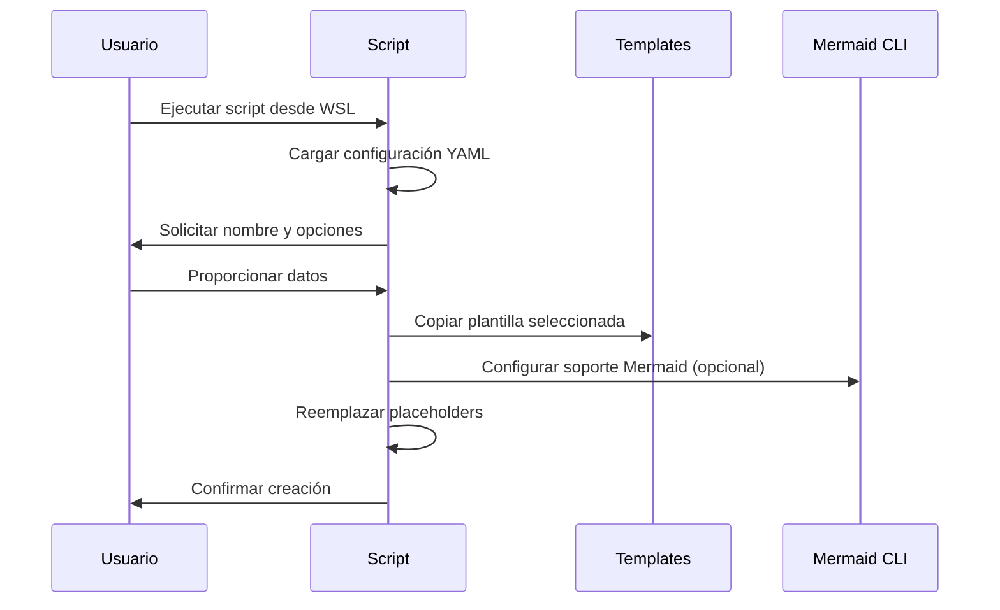
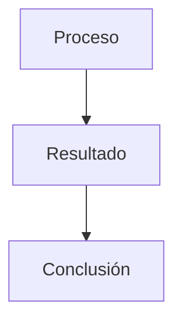

# Sistema de Plantillas LaTeX

Sistema automatizado para crear y gestionar proyectos LaTeX con plantillas preconfiguradas, soporte para diagramas Mermaid y configuración optimizada para VSCode en Windows con MiKTeX y LaTeX Workshop.

## Diagrama de Flujo del Proceso



## Diagrama de Secuencia - Creación de Proyecto



## Requisitos del Sistema

### Entorno Recomendado
- **Sistema Operativo**: Windows 10/11 con WSL2 (Ubuntu recomendado)
- **Editor**: Visual Studio Code con extensión LaTeX Workshop
- **Distribución LaTeX**: MiKTeX 
- **Herramientas Adicionales**: 
  - Node.js y npm (para Mermaid CLI)
  - Perl (para latexmk)
  - Git para control de versiones

### Configuración de VSCode
1. Instalar extensión **LaTeX Workshop**
2. Configurar compilador predeterminado: `latexmk`
3. Establecer PDF viewer interno
4. Habilitar compilación automática

## Instalación y Configuración

### 1. Preparación del Entorno (Script Automático)
Para facilitar la preparación del ambiente en Windows, se incluye el script `setup.bat` (ubicado en `templates/mermaid/`).

Este script automatiza la verificación e instalación de dependencias críticas:
- Verifica la existencia de **Node.js** y **Perl**.
- Instala **Mermaid CLI** globalmente si no se encuentra.
- Configura las carpetas necesarias para los diagramas.

### 2. Configurar MiKTeX en Windows 
Se recomienda usar **winget** para una instalación rápida desde PowerShell:
```powershell
winget install MiKTeX.MiKTeX
```
Alternativamente, descargar desde [miktex.org](https://miktex.org).

*Nota: No es necesario configurar MiKTeX dentro de WSL, ya que la compilación se realiza nativamente en Windows con VSCode.*

## Uso del Sistema

### Crear Nuevo Proyecto
```bash
bash create_latex_project.sh
```

El script guiará a través de:
1. **Configuración**: Cargará o solicitará datos del autor
2. **Nombre del proyecto**: Definir nombre descriptivo
3. **Destino**: Seleccionar institución o ruta personalizada en `latex_projects/`
4. **Plantilla**: Elegir entre APA, IEEE, Letter, Essay, General
5. **Soporte Mermaid**: Opcional para diagramas automáticos

### Estructura Generada
```
latex_projects/institucion/nombre_proyecto/
├── main.tex              # Documento principal
├── sections/             # Secciones del documento
├── references.bib        # Bibliografía
├── config.yaml           # Configuración específica
├── assets/               # Recursos (imágenes, diagramas)
│   ├── mermaid/         # Archivos .mmd
│   └── diagrams/        # Diagramas generados (.png)
└── .latexmkrc           # Configuración compilación (si Mermaid)
```

### Compilación de Proyectos
```bash
# Navegar al proyecto
cd latex_projects/universidad/mi_proyecto

# Compilar con latexmk (recomendado)
latexmk -pdf main.tex

# Compilación manual (si es necesario)
pdflatex main.tex
bibtex main
pdflatex main.tex
pdflatex main.tex
```

## Flujo de Trabajo Completo

### 1. Creación del Proyecto
- Ejecutar script desde WSL
- Seleccionar plantilla adecuada al tipo de documento
- Configurar datos del autor y metadatos
- Opcionalmente incluir soporte Mermaid

### 2. Desarrollo del Documento
- Editar `main.tex` y secciones en `sections/`
- Agregar referencias en `references.bib`
- Crear diagramas en `assets/mermaid/*.mmd`
- Insertar imágenes en `assets/images/`

### 3. Compilación y Visualización
- LaTeX Workshop compila automáticamente en VSCode
- Los diagramas Mermaid se generan durante la compilación
- PDF se actualiza en tiempo real en visor interno
- Referencias y citas se resuelven automáticamente

### 4. Control de Versiones
- Los templates están versionados en este repositorio
- Los proyectos en `latex_projects/` están ignorados en git
- Cada proyecto puede tener su propio repositorio git

## Soporte para Diagramas Mermaid

### Configuración Automática
Al seleccionar soporte Mermaid durante la creación del proyecto:
- Se copia `.latexmkrc` con reglas de compilación
- Se crean directorios `assets/mermaid/` y `assets/diagrams/`
- Se configura compilación automática de `.mmd` a `.png`

### Creación de Diagramas
1. Crear archivo `.mmd` en `assets/mermaid/`:


2. Incluir en documento LaTeX:
```latex
\begin{figure}[H]
    \centering
    \includegraphics[width=0.8\textwidth]{assets/diagrams/mi_diagrama.png}
    \caption{Descripción del diagrama}
    \label{fig:mi_diagrama}
\end{figure}
```

3. Compilar con `latexmk -pdf main.tex`

## Separación de Repositorios

### Filosofía de Diseño
- **Este repositorio**: Contiene solo plantillas y herramientas
- **Proyectos individuales**: Almacenados en `latex_projects/` (ignorado en git)
- **Ventajas**:
  - Plantillas versionadas centralmente
  - Proyectos independientes y portables
  - Pueden versionarse en repositorios separados
  - Evita contaminación del repositorio de templates

### Migrar Proyecto a Repositorio Independiente
```bash
# Navegar al proyecto
cd latex_projects/universidad/mi_proyecto

# Inicializar nuevo repositorio git
git init
git add .
git commit -m "Initial commit"

# Agregar remote y subir
git remote add origin <url-del-repositorio>
git push -u origin main
```

## Solución de Problemas

### Errores Comunes

#### 1. Permisos de Ejecución
```bash
chmod +x create_latex_project.sh
```

#### 2. Mermaid CLI No Encontrado
```bash
# Verificar instalación
which mmdc

# Reinstalar globalmente
sudo npm install -g @mermaid-js/mermaid-cli
```

#### 3. LaTeX Workshop No Compila
- Verificar configuración de `latexmk`
- Asegurar que MiKTeX/TeX Live está en PATH
- Revisar logs de LaTeX Workshop en VSCode

#### 4. Caracteres Especiales en Español
```latex
% Incluir en preámbulo
\usepackage[utf8]{inputenc}
\usepackage[T1]{fontenc}
\usepackage[spanish]{babel}
```

### Recursos Adicionales
- [Documentación de LaTeX Workshop](https://github.com/James-Yu/LaTeX-Workshop)
- [Guía de Mermaid](https://mermaid.js.org/)
- [MiKTeX Documentation](https://miktex.org/docs)
- [TeX Live Guide](https://tug.org/texlive/)

## Contribución y Mejoras

### Reportar Problemas
1. Verificar si el problema ya existe en issues
2. Proporcionar información detallada:
   - Sistema operativo y versión
   - Distribución LaTeX utilizada
   - Salida de errores completa
   - Pasos para reproducir

### Sugerir Nuevas Plantillas
1. Crear nueva carpeta en `templates/`
2. Incluir documentación en español
3. Probar compilación con múltiples motores
4. Enviar pull request

## Licencia y Uso

Este sistema de plantillas es de uso libre para fines académicos y personales. Se agradece la atribución al autor original.

---

**Nota**: Este README fue generado automáticamente y puede actualizarse. Para la última versión, consultar el repositorio oficial.