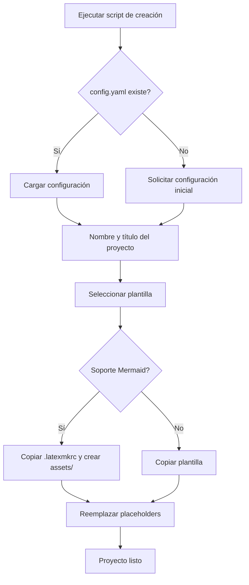

# Sistema de Plantillas LaTeX

Sistema automatizado multiplataforma para crear y gestionar proyectos LaTeX con plantillas preconfiguradas y soporte para diagramas Mermaid. Compatible con **Windows**, **macOS** y **Linux**.

## Flujo del proceso



## Requisitos por plataforma

### Windows
- Windows 10/11
- [MiKTeX](https://miktex.org/)
- Node.js + npm
- Perl (para latexmk)
- Mermaid CLI
- VSCode con extensión **LaTeX Workshop** (recomendado)

### macOS
- macOS 10.15+
- [MacTeX](https://www.tug.org/mactex/) o [BasicTeX](https://www.tug.org/mactex/morepackages.html)
- Node.js + npm (vía Homebrew)
- Perl (incluido en macOS)
- Mermaid CLI

### Linux
- Distribución moderna (Ubuntu 20.04+, Fedora 35+, Arch, etc.)
- TeX Live (`texlive-latex-base`, `texlive-latex-extra`)
- Node.js + npm
- Perl (generalmente preinstalado)
- Mermaid CLI

## Instalación automática de dependencias

### Windows
Ejecuta como **Administrador**:

```powershell
Set-ExecutionPolicy -Scope Process -ExecutionPolicy Bypass
.\setup-latex-mermaid.ps1
```

### macOS / Linux
Ejecuta en terminal:

```bash
chmod +x setup-latex-mermaid.sh
./setup-latex-mermaid.sh
```

El script detecta automáticamente tu sistema operativo y gestor de paquetes (Homebrew, apt, dnf, pacman) e instala las dependencias necesarias.

## Crear un proyecto

### Windows
```powershell
.\create_latex_project.bat
```

### macOS / Linux
```bash
./create_latex_project.sh
```

El script solicita:
1. Configuración del autor (cargada desde `config.yaml` si existe)
2. Nombre del proyecto y título del documento
3. Destino dentro de `latex_projects/`
4. Plantilla a usar
5. Soporte opcional para Mermaid

### Estructura generada

```
latex_projects/destino/nombre_proyecto/
├── main.tex
├── sections/
├── bib/references.bib
├── assets/
│   ├── mermaid/      # Archivos .mmd (si Mermaid activo)
│   └── diagrams/     # PNGs generados
└── .latexmkrc        # Si Mermaid activo
```

## Plantillas disponibles

| Plantilla | Descripción |
|---|---|
| `apa_general` | APA 7 genérico |
| `apa_unisalle` | APA con portada Universidad La Salle |
| `ieee` | Formato IEEE journal |
| `letter` | Carta formal |
| `general` | Documento básico |

## Diagramas Mermaid

1. Crear `assets/mermaid/diagrama.mmd`
2. Incluir en LaTeX:
```latex
\begin{figure}[H]
    \centering
    \includegraphics[width=0.8\textwidth]{assets/diagrams/diagrama.png}
    \caption{Descripción}
    \label{fig:diagrama}
\end{figure}
```
3. Compilar con `latexmk -pdf main.tex`

## Compilación

### Windows
```powershell
cd latex_projects\destino\mi_proyecto
latexmk -pdf main.tex
```

### macOS / Linux
```bash
cd latex_projects/destino/mi_proyecto
latexmk -pdf main.tex
```

## Estructura del repositorio

```
LaTeX_env/
├── .creator/
│   ├── config.ps1              # Lectura/escritura config.yaml (Windows)
│   ├── config.sh               # Lectura/escritura config.yaml (macOS/Linux)
│   ├── config.yaml             # Configuración del autor
│   ├── placeholders.ps1        # Reemplazo de placeholders (Windows)
│   ├── placeholders.sh         # Reemplazo de placeholders (macOS/Linux)
│   └── create_latex_project.ps1  # Script de creación (Windows)
├── templates/                  # Plantillas reutilizables
├── create_latex_project.bat    # Launcher Windows
├── create_latex_project.sh     # Launcher macOS/Linux
├── setup-latex-mermaid.ps1     # Setup Windows
├── setup-latex-mermaid.sh      # Setup macOS/Linux
└── latex_projects/             # Proyectos creados (ignorado en git)
```

## Solución de problemas

### Windows
**Mermaid no genera imágenes**: verifica que `mmdc` esté en PATH ejecutando `setup-latex-mermaid.ps1`.

**LaTeX Workshop no compila**: asegura que `pdflatex` y `latexmk` estén en PATH (MiKTeX instalado).

### macOS / Linux
**Permisos de ejecución**: ejecuta `chmod +x *.sh` en el directorio raíz.

**LaTeX no encontrado**: después de instalar BasicTeX en macOS, reinicia la terminal o ejecuta `eval "$(/usr/libexec/path_helper)"`.

**mmdc no encontrado**: asegura que Node.js esté instalado y ejecuta `npm install -g @mermaid-js/mermaid-cli`.

### General
**Caracteres especiales**: todos los templates incluyen `inputenc`, `fontenc` y `babel` en español.

**Scripts no compatibles entre plataformas**: usa `.bat`/`.ps1` en Windows y `.sh` en macOS/Linux. No son intercambiables.
