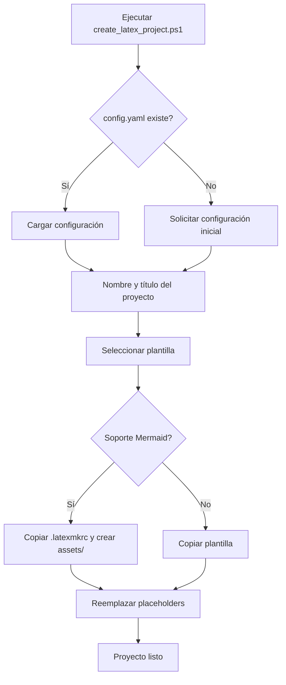

# Sistema de Plantillas LaTeX

Sistema automatizado para crear y gestionar proyectos LaTeX con plantillas preconfiguradas y soporte para diagramas Mermaid. Optimizado para Windows con MiKTeX y VSCode.

## Flujo del proceso



## Requisitos

- Windows 10/11
- [MiKTeX](https://miktex.org/)
- Node.js + npm
- Perl (para latexmk)
- Mermaid CLI (`npm install -g @mermaid-js/mermaid-cli`)
- VSCode con extensión **LaTeX Workshop**

### Instalación automática de dependencias

Ejecuta como **Administrador**:

```powershell
Set-ExecutionPolicy -Scope Process -ExecutionPolicy Bypass
.\setup-latex-mermaid.ps1
```

Instala y valida MiKTeX, Node.js, Perl y Mermaid CLI automáticamente.

## Crear un proyecto

```powershell
Set-ExecutionPolicy -Scope Process -ExecutionPolicy Bypass
.\create_latex_project.ps1
```

El script solicita:
1. Configuración del autor (cargada desde `config.yaml` si existe)
2. Nombre del proyecto y título del documento
3. Destino dentro de `latex_projects/`
4. Plantilla a usar
5. Soporte opcional para Mermaid

### Estructura generada

```
latex_projects/destino/nombre_proyecto/
├── main.tex
├── sections/
├── bib/references.bib
├── assets/
│   ├── mermaid/      # Archivos .mmd (si Mermaid activo)
│   └── diagrams/     # PNGs generados
└── .latexmkrc        # Si Mermaid activo
```

## Plantillas disponibles

| Plantilla | Descripción |
|---|---|
| `apa_general` | APA 7 genérico |
| `apa_unisalle` | APA con portada Universidad La Salle |
| `ieee` | Formato IEEE journal |
| `letter` | Carta formal |
| `general` | Documento básico |

## Diagramas Mermaid

1. Crear `assets/mermaid/diagrama.mmd`
2. Incluir en LaTeX:
```latex
\begin{figure}[H]
    \centering
    \includegraphics[width=0.8\textwidth]{assets/diagrams/diagrama.png}
    \caption{Descripción}
    \label{fig:diagrama}
\end{figure}
```
3. Compilar con `latexmk -pdf main.tex`

## Compilación

```powershell
cd latex_projects\destino\mi_proyecto
latexmk -pdf main.tex
```

## Estructura del repositorio

```
LaTeX_env/
├── .helpers/
│   ├── config.ps1          # Lectura/escritura de config.yaml
│   └── placeholders.ps1    # Reemplazo de placeholders en .tex
├── templates/              # Plantillas reutilizables
├── create_latex_project.ps1
├── setup-latex-mermaid.ps1
├── config.yaml             # Configuración del autor (generado)
└── latex_projects/         # Proyectos creados (ignorado en git)
```

## Solución de problemas

**Mermaid no genera imágenes**: verifica que `mmdc` esté en PATH ejecutando `setup-latex-mermaid.ps1`.

**LaTeX Workshop no compila**: asegura que `pdflatex` y `latexmk` estén en PATH (MiKTeX instalado).

**Caracteres especiales**: todos los templates incluyen `inputenc`, `fontenc` y `babel` en español.
