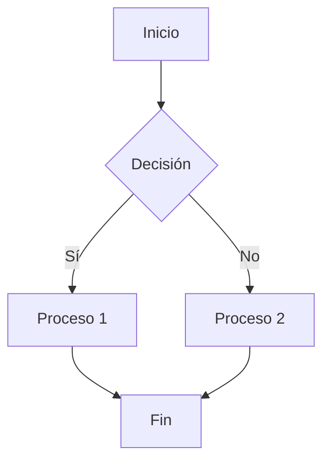

# Template Mermaid - Diagramas en LaTeX

Este template proporciona una solución completa para generar diagramas Mermaid automáticamente dentro de tus proyectos LaTeX.

## Estructura

```
tu_proyecto/
├── tu_documento.tex
├── .latexmkrc              # Copiar este archivo
├── setup.bat              # (Opcional) Verificar dependencias e instalar
└── assets/
    ├── diagrams/           # Se generan automáticamente los .png
    └── mermaid/            # Tus archivos .mmd
```

## Instalación

### 1. Requisitos

Se requieren los siguientes componentes:

#### Node.js
Si no tienes Node.js instalado, descárgalo desde [nodejs.org](https://nodejs.org/) o instala con winget:

```powershell
winget install OpenJS.NodeJS
```

#### Perl
Requerido para latexmk. En Windows con winget:

```powershell
winget install Perl.Perl
```

#### Mermaid CLI
Instala globalmente via npm:

```powershell
npm install -g @mermaid-js/mermaid-cli
```

### 2. Configuración rápida (Windows)

Ejecuta `setup.bat` para verificar dependencias e instalar automáticamente:

```powershell
setup.bat
```

Este script:
- Verifica Node.js, npm y Mermaid CLI
- Instala Mermaid CLI si no está
- Crea la estructura de carpetas `assets/`
- Genera un diagrama de ejemplo
- Compila todos los `.mmd` en `assets/mermaid/`

### 2. Configuración del proyecto

1. Copia el archivo `.latexmkrc` a la raíz de tu proyecto
2. Crea la estructura de carpetas:

```bash
mkdir -p tu_proyecto/assets/diagrams tu_proyecto/assets/mermaid
```

## Uso

### Crear diagramas

1. Crea tus archivos `.mmd` en `assets/mermaid/`

Ejemplo (`assets/mermaid/diagrama1.mmd`):


### Incluir en LaTeX

En tu documento `.tex`:

```latex
\usepackage{graphicx}

\begin{figure}[H]
    \centering
    \includegraphics[width=0.8\textwidth]{assets/diagrams/diagrama1.png}
    \caption{Tu descripción}
    \label{fig:diagrama1}
\end{figure}
```

### Compilar

Con LaTeX Workshop (VS Code) funciona automáticamente.

Manual:
```bash
latexmk -pdf tu_documento.tex
```

## Configuración adicional

Puedes modificar el tamaño de los diagramas en `.latexmkrc`:

```perl
system("mmdc.cmd -i \"assets/mermaid/$_[0].mmd\" -o \"assets/diagrams/$_[0].png\" -w 1200");
```

Parámetros disponibles:
- `-w <ancho>` - Ancho del diagrama
- `-s <escala>` - Escala (por defecto 1)
- `-b <formato>` - Formato de salida (png, svg, pdf)

Ejemplo con escala:
```perl
system("mmdc.cmd -i \"assets/mermaid/$_[0].mmd\" -o \"assets/diagrams/$_[0].png\" -w 1200 -s 2");
```
