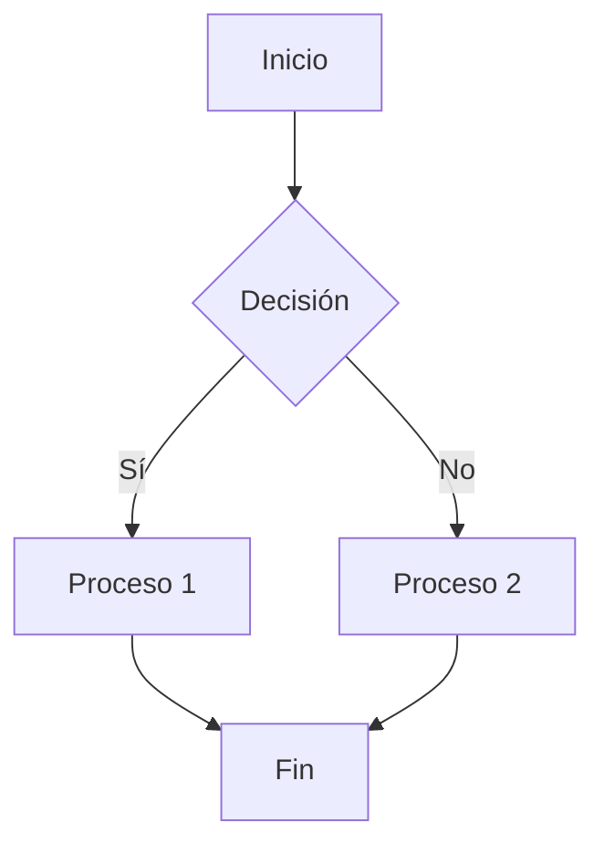

# Template Mermaid - Diagramas en LaTeX

Este template proporciona una solución completa para generar diagramas Mermaid automáticamente dentro de tus proyectos LaTeX.

## Estructura

```
tu_proyecto/
├── documento.tex
├── .latexmkrc              # Configura compilación automática
└── assets/
    ├── diagrams/           # Diagramas generados (.png)
    └── mermaid/            # Archivos fuente (.mmd)
```

**Nota**: Para configurar dependencias, ejecuta `setup-latex-mermaid.ps1` como Administrador (ver README principal).

## Uso básico

### 1. Crear diagramas
Crea archivos `.mmd` en `assets/mermaid/`:

**Ejemplo: Diagrama de flujo**


### 2. Incluir en LaTeX
```latex
\usepackage{graphicx,float}

\begin{figure}[H]
    \centering
    \includegraphics[width=0.8\textwidth]{assets/diagrams/diagrama.png}
    \caption{Descripción}
    \label{fig:diagrama}
\end{figure}
```

### 3. Compilar
```bash
latexmk -pdf documento.tex
```

## Configuración adicional

Puedes modificar el tamaño de los diagramas en `.latexmkrc`:

```perl
system("mmdc.cmd -i \"assets/mermaid/$_[0].mmd\" -o \"assets/diagrams/$_[0].png\" -w 1200");
```

Parámetros disponibles:
- `-w <ancho>` - Ancho del diagrama
- `-s <escala>` - Escala (por defecto 1)
- `-b <formato>` - Formato de salida (png, svg, pdf)

Ejemplo con escala:
```perl
system("mmdc.cmd -i \"assets/mermaid/$_[0].mmd\" -o \"assets/diagrams/$_[0].png\" -w 1200 -s 2");
```

## Documentación
Para aprender más sobre sintaxis Mermaid:
- [Introducción a Mermaid](https://mermaid.js.org/intro/)
